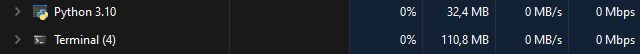

<h1 align="center">Projeto Araucaria</h1>

<p align="center">
  
  
  
</p>

## Visão geral 

O projeto se chama Araucária em homenagem à minha futura esposa, que é bióloga. Gosto de utilizar nomes de árvores como forma de homenageá-la e, dessa vez, escolhi a Araucária por sua importância na região Sul do Brasil, onde vivemos.

O projeto consiste em um programa escrito em Python que fornece uma interface de usuário para ajudar os usuários a gerenciar seus projetos no Easy Redmine. O programa possui uma janela fixa que permite aos usuários controlar as tarefas em que estão trabalhando.

Além disso, o programa observa as telas ativas do usuário e gera um relatório e estatísticas sobre o que o usuário fez durante o tempo que passou naquela atividade. Essas informações podem ajudar o usuário a entender melhor como está gastando seu tempo e onde pode melhorar sua produtividade.

## A ligação entre Araucária e o propósito do projeto

Assim como a Araucária é uma espécie chave na manutenção do ecossistema da região sul, meu projeto também tem como objetivo ser uma ferramenta chave para o gerenciamento de projetos no Easy Redmine. Com o programa, os usuários podem gerenciar suas tarefas de forma mais eficiente, melhorando sua produtividade e permitindo uma melhor organização de seus projetos. Espero que assim como a Araucária, meu projeto possa contribuir para a manutenção de um ecossistema produtivo e organizado em empresas e equipes.

## Características

- Conecta-se ao Easy Redmine via API REST para recuperar informações sobre as tarefas do usuário
- Permite que o usuário visualize e atualize tarefas diretamente na janela do programa
- Apresenta uma interface de usuário intuitiva com barra de menu e lista de tarefas
- Possui uma funcionalidade de temporizador integrada para rastrear o tempo gasto em cada tarefa

## Instalação

1. Clone o repositório:

```sh
git clone https://github.com/seu_usuario/seu_projeto.git
```

2. Instale as dependências:
```sh
pip install -r requirements.txt
```

## Como usar
1. Execute o arquivo main.py:
```sh
python start.py
```
2. Siga as instruções na tela para gerenciar suas tarefas no Easy Redmine.

# Contribuição
Contribuições são bem-vindas! Para sugestões ou correções, crie uma branch.

## Consumo de memoria


